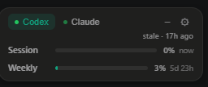
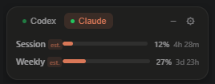
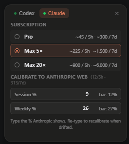
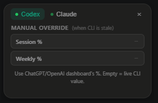

<div align="center">

# usage-radar

**Watch your Claude Code & OpenAI Codex CLI usage from your desktop — without alt-tabbing to a dashboard.**

[English](README.md) · [繁體中文](docs/README.zh-TW.md) · [简体中文](docs/README.zh-CN.md) · [日本語](docs/README.ja.md) · [한국어](docs/README.ko.md)

[](LICENSE)
[](https://tauri.app)


<br>


&nbsp;&nbsp;


</div>

---

## Why?

Anthropic and OpenAI both hide subscription usage behind a browser tab. Power users of **Claude Code** and **OpenAI Codex CLI** want a glanceable indicator on the desktop — no alt-tabbing, no logging in, no extension.

**usage-radar** is a tiny rounded card pinned to the top-right of your screen. It reads your local CLI logs and shows session + weekly progress with brand colours. That's it.

## Features

- 🎯 **Two sources, one glance** — Tab between Codex (OpenAI green) and Claude (Anthropic warm orange).
- 🪶 **Tiny** — Tauri 2 + React. Release binary is ~10 MB; RAM footprint ~30 MB.
- 🔒 **Local-only** — No backend, no telemetry, no login. Parsers read only quota fields, never prompts or tool outputs.
- 🎛️ **Tab-aware settings** — Gear opens different content per tab; card auto-resizes.
- 🎚️ **Calibration** — Pin Claude's bar to your Anthropic dashboard with one input.
- 🏷️ **Staleness aware** — "stale · 17h ago" tag appears when CLI rollout hasn't updated.
- 🟢 **System tray** — Hide to tray, click to restore. Show / Hide / Settings / Quit from the menu.
- 📌 **Always-on-top + frameless** — A floating widget, not a window.

## Quick start

### Non-developers — the easy way

Pre-built installers will appear on the [Releases page](https://github.com/Tsai1030/usage-radar/releases). Until v0.1 ships, please use the developer install below.

When releases are available:

1. Download the `.msi` (Windows) / `.dmg` (macOS) / `.AppImage` (Linux).
2. Double-click to install.
3. Launch from Start Menu / Applications.
4. The card appears top-right; the icon sits next to your clock.

### Developers — clone & run

You need two tools (one-time install, global, used by all projects):

- **Rust** toolchain
- **bun** package manager

<details>
<summary><b>Windows (PowerShell)</b></summary>

```powershell
# 1. Install tools (once)
winget install --id Rustlang.Rustup
winget install --id Oven-sh.Bun

# 2. Clone and launch
git clone https://github.com/Tsai1030/usage-radar.git
cd usage-radar
.\scripts\start.ps1
```

`start.ps1` checks prerequisites, installs deps if needed, then runs the app.
First Rust compile downloads ~1 GB and takes 5–10 min; subsequent runs are seconds.

</details>

<details>
<summary><b>macOS / Linux</b></summary>

```bash
# 1. Install tools (once)
curl --proto '=https' --tlsv1.2 -sSf https://sh.rustup.rs | sh
curl -fsSL https://bun.sh/install | bash

# 2. Clone and launch
git clone https://github.com/Tsai1030/usage-radar.git
cd usage-radar
bun install
bun run tauri dev
```

</details>

### Build your own installer

```powershell
.\scripts\build.ps1       # Windows
# or
bun run tauri build       # any platform
```

Output appears in `src-tauri/target/release/bundle/`.

## How to use it

1. **Launch**. Card appears top-right; tray icon appears next to the clock.
2. **Switch source** with the two tabs (Codex / Claude).
3. **Hide** with the `−` button (it goes to the tray; left-click the tray icon to restore).
4. **Settings** with the `⚙` button. Each tab has its own panel:
   - **Claude**: pick your subscription tier (Pro / Max 5× / Max 20×) → set defaults. Optionally enter the % you see on the Anthropic web dashboard → app calibrates.
   - **Codex**: enter the % from the OpenAI dashboard if the CLI rollout is stale (e.g. you used the web). Empty = use live CLI value.
5. **Quit** from the tray right-click menu.

## Calibration

The gear opens different content per tab. Card resizes to fit.

<p align="center">
  
  &nbsp;&nbsp;
  
</p>

**Claude has no public usage API**, so the bar is an *estimate*. To pin it to the official dashboard:

1. Open the Anthropic web dashboard. Note the **session %** and **weekly %**.
2. In the Claude settings tab, type those percentages into **Session %** and **Weekly %**.
3. The app reads your current local count, divides by your %, and saves the resulting cap.
4. The bar tracks proportionally as you use Claude. Re-enter to recalibrate if it drifts.

**Codex** uses the real `rate_limits` payload from CLI calls — accurate while you're using the CLI. When CLI is stale (web / IDE usage), open Codex settings and type the % from the OpenAI dashboard. Clear to fall back to live.

## Privacy

This is a **local-only** tool by design:

- **No backend, no telemetry, no auto-update phone-home.**
- The Claude parser reads only: `type`, `userType`, `isSidechain`, `timestamp`, and `message.usage` (token counts only).
- The Codex parser reads only: the `rate_limits` payload (percentages, window minutes, reset timestamp).
- **Never reads** prompt content, tool outputs, file contents, or any secret material.
- Settings stored at `~/.usage-radar/settings.json` (local file).

The open-source code lets you verify this yourself.

## Architecture

```
src/                          # React + TypeScript frontend
  App.tsx                     # Card + tab routing + settings body
  types.ts                    # Shared types with backend
  App.css                     # Dark theme + brand colour system

src-tauri/                    # Rust backend (Tauri 2)
  src/
    lib.rs                    # Builder, commands, tray icon, window positioning
    scheduler.rs              # 30 s polling loop, emits `usage-update`
    settings.rs               # Load/save ~/.usage-radar/settings.json
    sources/
      mod.rs                  # UsageSource trait + shared types
      codex.rs                # Reads ~/.codex/sessions/.../rollout-*.jsonl
      claude.rs               # Aggregates ~/.claude/projects/.../*.jsonl
  capabilities/default.json   # Permission allowlist
  tauri.conf.json             # 260×100 frameless transparent window

scripts/                      # One-click launchers (Windows)
  start.ps1
  build.ps1
```

Adding a new source (e.g. Gemini CLI) is one file implementing the `UsageSource` trait.

## Roadmap

- **v0.1** (current): Phase 1 MVP — both parsers, settings, tray, calibration, stale indicator.
- **v0.2**: File watcher (`notify` crate), edge-state polish, error UI for missing paths / locked files / schema drift.
- **v0.3**: Auto-update, Windows / macOS code signing, Linux AppImage.
- **v0.4**: i18n in-app, theming, optional collapsed "puck" mode (a tiny draggable icon that expands with animation).
- **future**: more sources (Gemini CLI, Cursor, etc.) via the `UsageSource` trait.

## Contributing

Issues and PRs welcome. The upstream CLI tools (Claude Code, Codex CLI) **will change their log schemas** without notice — schema-detection warnings and parser updates are the most useful contributions.

Keep the parser modules isolated and the `UsageSource` trait stable so new sources stay easy to add.

## License

[MIT](LICENSE) — do what you want.
